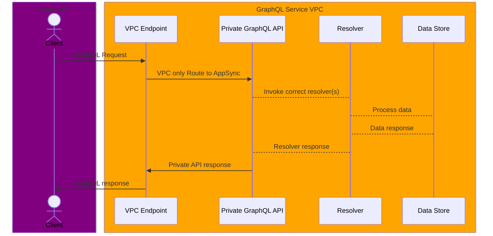

# Todo Demo

This demo explores the structure of internal-use GraphQL APIs using the new Private APIs on AWS AppSync.

Note; this repo and discussion are for demonstration purposes only. A production setup will require appropriate lockdown and should be integrated with your existing deployments.

## Architecture

This new private API capability on AppSync allows us to create a private visibility endpoint. In this repo, we'll explore the following flow.

### Diving Deeper

For our use case we will have two VPCs setup and for convenience will use the same region. Multi-regional availability is beyond this scope.

This allows us to simulate an internal-use AppSync API to support our todos GraphQL API.

## Tasks

- [ ] Setup Client VPC via CloudFormation
- [ ] Setup GraphQL VPC via CloudFormation
  - [ ] Setup VPCe for GraphQL VPC
  - [ ] Set Policies for Least-privilege Access
- [ ] [Service Control Policy (SCP)](https://docs.aws.amazon.com/organizations/latest/userguide/orgs_manage_policies_scps.html) to block any public API creation
  - [x] Build [SCP Enforcement Policy](./iam/private-appsync-only-scp.json)
- [ ] Setup Todo Private API on AppSync
  - [ ] Setup Schema
  - [ ] Setup Private Visibility AppSync API via CloudFormation
  - [ ] Setup DynamoDB as data store
  - [ ] Setup IAM Execution Role for AppSync
    - [ ] Allow DynamoDB access directly from AppSync
  - [ ] Configure AppSync Schema
  - [ ] Configure AppSync resolver for DynamoDB
- [ ] Setup Client Calling Application

## References

1. [Introducing Private APIs on AWS AppSync](https://aws.amazon.com/blogs/mobile/introducing-private-apis-on-aws-appsync/)
1. [Using IAM policies to limit public API creation](https://docs.aws.amazon.com/appsync/latest/devguide/using-private-apis.html#blocking-public-apis)
